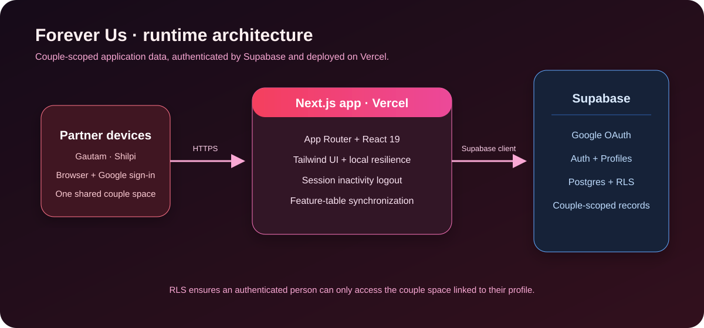
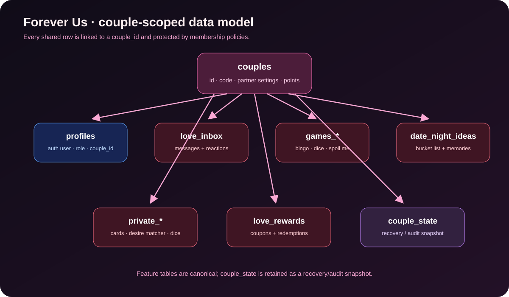

# Forever Us

Forever Us is a private, couple-focused web application for small everyday moments: affectionate requests, shared games, date ideas, rewards, and an adults-only private zone. Each person signs in to a fixed partner role, and every shared record is scoped to one couple space.

> This repository is intentionally opinionated: it is a personal couple product, not a multi-tenant social platform.

## Product capabilities

- **Daily Love:** rotating sweet, funny, memory, date, deep, and flirty prompts.
- **Love Inbox:** timestamped quick actions such as a kiss, hug, cuddle, coffee, or “come here.”
- **Games:** Couple Bingo, editable Reveal Dice decks, and Spoil Me requests that can be accepted, completed, awarded points, and linked to rewards.
- **Date Night:** filterable date inspiration and an editable bucket list with completion notes and ratings.
- **Love Rewards:** shared Love Coins, editable coupons, redemption status, and refunds.
- **Private Zone:** private cards, editable Pleasure Dice and Tease Timer choices, a mutual Heat Meter, and the Desire Matcher. A match is revealed only after both partners opt in.
- **Personalization:** light, dark, and red themes; editable names, avatars, anniversary, and coupons.

## Architecture



### Design principles

1. **Identity before profile.** Google OAuth or email authentication establishes who is using the app; `profiles.role` decides whether that person is Partner 1 or Partner 2. The UI does not offer profile switching.
2. **Couple isolation by default.** Every shared database row belongs to a `couple_id`; Supabase Row Level Security checks that the signed-in user is a member of that couple.
3. **Feature tables are canonical.** Bingo, requests, dates, inbox messages, rewards, private content, and dice decks are stored in dedicated tables. `couple_state` is a recovery/audit snapshot, not the primary business-data store.
4. **Resilient experience.** Local storage maintains a browser-level copy while Supabase holds shared cloud data.
5. **No server secret in the browser.** Only Supabase’s publishable/anon key is exposed to the client. Never place a service-role key in a `NEXT_PUBLIC_*` variable.

## Data model



| Area | Canonical table(s) |
| --- | --- |
| Couple identity and membership | `couples`, `profiles` |
| Love Inbox | `love_inbox` |
| Games | `games_couples_bingo`, `games_reveal_dice`, `games_spoil_me`, `games_truth_or_dare` |
| Date Night | `date_night_ideas` |
| Private Zone | `private_zone_cards`, `private_desire_matcher`, `private_pleasure_dice` |
| Rewards | `love_rewards`, `love_reward_redemptions` |
| Recovery / audit | `couple_state` |

## Technology stack

| Layer | Choice |
| --- | --- |
| Web framework | Next.js 16, App Router, React 19, TypeScript |
| UI | Tailwind CSS 4, Lucide icons, Framer Motion |
| Authentication | Supabase Auth — Google OAuth and email magic links |
| Data | Supabase Postgres with Row Level Security |
| Hosting | Vercel |

## Local development

### Prerequisites

- Node.js 20 or newer
- A Supabase project for authenticated/cloud mode (optional for basic local UI work)

### Install and run

```bash
npm install
cp .env.example .env.local
npm run dev
```

Open [http://localhost:3000](http://localhost:3000).

Useful verification commands:

```bash
npx tsc --noEmit
npm run build
npm run lint
```

## Environment configuration

Create `.env.local` from [`.env.example`](.env.example):

```env
NEXT_PUBLIC_SUPABASE_URL=https://your-project-ref.supabase.co
NEXT_PUBLIC_SUPABASE_ANON_KEY=your-publishable-or-anon-key
```

`NEXT_PUBLIC_*` values are embedded in the browser bundle. The Supabase URL and publishable/anon key are intended for this; a **service-role key is not**.

## Supabase setup

1. Create a Supabase project.
2. In **Authentication → Providers**, enable Google if using Google sign-in. Add your local and Vercel URLs to the allowed redirect URLs.
3. Open **SQL Editor** and run [`supabase/schema.sql`](supabase/schema.sql) for a new database.
4. For an existing database, apply migrations in order:

   1. [`001_add_couple_state.sql`](supabase/migrations/001_add_couple_state.sql)
   2. [`002_store_feature_data_in_tables.sql`](supabase/migrations/002_store_feature_data_in_tables.sql)
   3. [`003_use_logical_feature_table_names.sql`](supabase/migrations/003_use_logical_feature_table_names.sql)
   4. [`004_refine_private_table_names.sql`](supabase/migrations/004_refine_private_table_names.sql) — only if migration 003 was applied before the private-table naming refinement.

5. Add the two environment values locally and in Vercel.

### Security model

- `profiles` links `auth.users` to one couple and one partner role.
- `public.is_couple_member(target_couple_id)` is used by RLS policies.
- Feature-table policies permit read/write only when `auth.uid()` belongs to the matching couple.
- Couple-space creation and joining are handled by authenticated Supabase RPC functions.

## Deployment on Vercel

1. Push the repository to GitHub.
2. Import it at [vercel.com/new](https://vercel.com/new).
3. Configure `NEXT_PUBLIC_SUPABASE_URL` and `NEXT_PUBLIC_SUPABASE_ANON_KEY` for Production, Preview, and Development as appropriate.
4. Deploy. Vercel automatically rebuilds when `main` receives a push.
5. Add the deployed URL to Supabase Auth redirect URLs, then verify Google sign-in in production.

## Operational notes

- Auth sessions sign out after one hour of inactivity; page focus alone does not reset that timer.
- Logging out manually also clears the local activity timestamp.
- Theme preference is browser-local by design.
- Feature-table writes are briefly batched to avoid a database call for every keystroke or rapid interaction.
- The application is an intimate personal space. Treat database backups, screen sharing, and Vercel/Supabase access as sensitive.

## Repository map

```text
app/                 Routes and page-level UI
components/          Shared UI, authentication gate, navigation, settings
lib/context/         Shared client state and Supabase synchronization
lib/supabase/        Browser Supabase client
lib/data/            Initial content and Daily Love prompt catalog
supabase/            Base schema, seed data, and incremental migrations
docs/                SVG architecture and data-model diagrams
```

## Contributing safely

- Keep client-visible configuration limited to the Supabase URL and publishable/anon key.
- Make database changes through a numbered migration and update this README when table names or setup steps change.
- Preserve `couple_id` ownership and RLS coverage for every new shared table.
- Run `npx tsc --noEmit` and `npm run build` before pushing.
